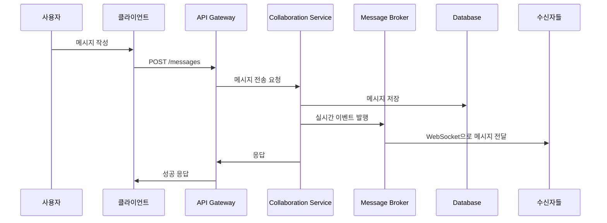
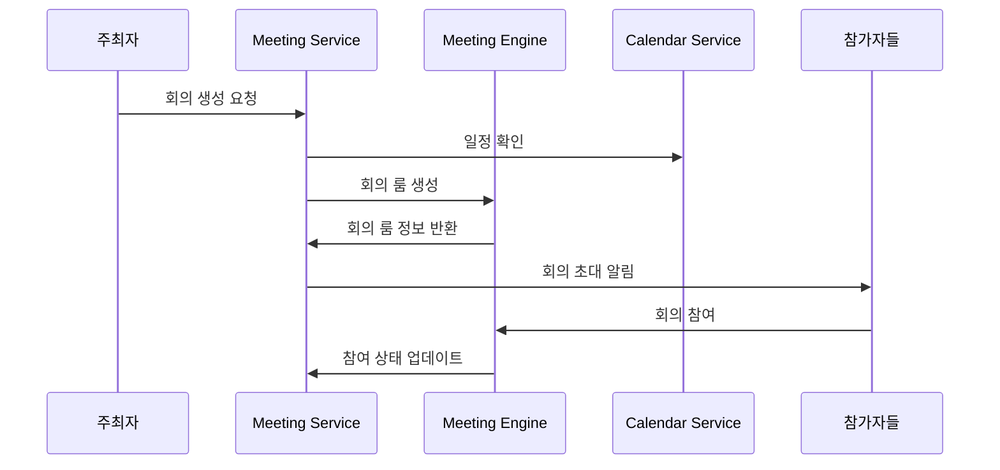
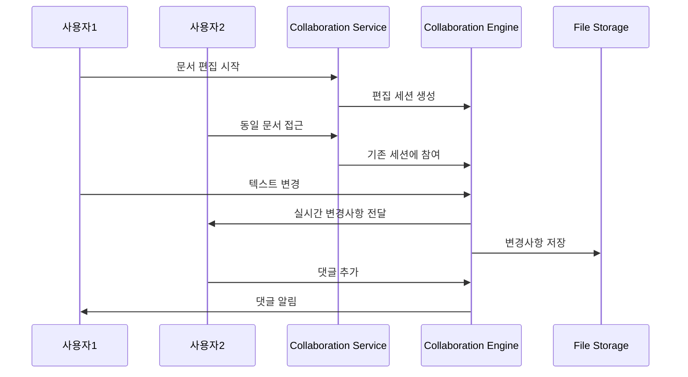

# Team Collaboration Service PRD

## 📌 서비스 개요

팀 구성원 간의 실시간 협업과 커뮤니케이션을 지원하는 통합 협업 플랫폼으로, 메시징, 화상회의, 문서 공동 편집, 워크스페이스 관리 기능을 제공합니다.

## 🎯 비즈니스 목표

1. **통합 커뮤니케이션**: 메시징, 화상회의, 음성통화를 하나의 플랫폼에서 제공
2. **실시간 협업**: 문서, 프로젝트, 아이디어에 대한 실시간 공동 작업
3. **워크스페이스 관리**: 팀별, 프로젝트별 전용 협업 공간 제공
4. **지식 공유**: 팀 내 지식과 경험의 효율적 공유 및 보존
5. **생산성 향상**: AI 기반 협업 지원 및 워크플로우 자동화

## 👥 사용자 스토리

### 팀 멤버
- 팀 채팅방에서 실시간 소통
- 프로젝트 관련 파일 공유 및 공동 편집
- 화상회의 참여 및 주최
- 작업 상태 및 가용성 표시
- 멘션 및 알림 받기

### 팀 리더
- 팀 워크스페이스 생성 및 관리
- 프로젝트별 협업 채널 운영
- 팀 성과 및 협업 지표 모니터링
- 외부 협력사와의 소통 관리
- 협업 규칙 및 가이드라인 설정

### 프로젝트 매니저
- 크로스 팀 협업 채널 관리
- 프로젝트 진행 상황 실시간 추적
- 스테이크홀더와의 소통 창구 역할
- 회의 일정 조율 및 관리
- 협업 효율성 분석

### 관리자
- 전사 커뮤니케이션 정책 관리
- 보안 및 컴플라이언스 모니터링
- 사용자 권한 및 접근 제어
- 협업 도구 통합 관리
- 조직 차원의 협업 분석

## 🏗 기술 아키텍처

### 핵심 컴포넌트
```
team-collaboration-service/
├── controller/
│   ├── WorkspaceController.java
│   ├── ChannelController.java
│   ├── MessageController.java
│   ├── MeetingController.java
│   ├── FileCollaborationController.java
│   └── NotificationController.java
├── service/
│   ├── WorkspaceService.java
│   ├── ChannelService.java
│   ├── MessageService.java
│   ├── MeetingService.java
│   ├── FileCollaborationService.java
│   ├── NotificationService.java
│   ├── PresenceService.java
│   └── IntegrationService.java
├── realtime/
│   ├── WebSocketHandler.java
│   ├── MessageBroker.java
│   ├── PresenceManager.java
│   └── EventPublisher.java
├── meeting/
│   ├── MeetingEngine.java
│   ├── ScreenShareService.java
│   ├── RecordingService.java
│   └── CalendarIntegration.java
├── collaboration/
│   ├── DocumentCollaboration.java
│   ├── WhiteboardService.java
│   ├── CodeReviewCollaboration.java
│   └── VersionControlService.java
└── ai/
    ├── MeetingSummaryService.java
    ├── SmartSuggestionService.java
    ├── TranslationService.java
    └── SentimentAnalysisService.java
```

## 🔑 주요 기능

### 1. 워크스페이스 관리
- **팀 워크스페이스 생성**: 팀별 전용 협업 공간
- **프로젝트 워크스페이스**: 프로젝트 중심의 임시 협업 공간
- **권한 관리**: 역할 기반 접근 제어
- **워크스페이스 템플릿**: 업무 유형별 사전 구성된 템플릿
- **외부 파트너 초대**: 제한된 권한으로 외부 사용자 초대

### 2. 실시간 메시징
- **채널 기반 소통**: 주제별, 프로젝트별 채널 구성
- **다이렉트 메시지**: 1:1 및 그룹 메시지
- **스레드 기능**: 메시지 스레드로 체계적 토론
- **파일 공유**: 드래그앤드롭 파일 업로드 및 공유
- **이모지 반응**: 빠른 반응 및 감정 표현
- **메시지 검색**: 전체 메시지 히스토리 검색
- **메멘션 시스템**: @사용자, @채널, @everyone 멘션

### 3. 화상회의 및 음성통화
- **HD 화상회의**: 최대 100명 참여 가능
- **화면 공유**: 전체 화면, 애플리케이션, 브라우저 탭 공유
- **가상 배경**: AI 기반 배경 블러 및 가상 배경
- **녹화 기능**: 회의 내용 자동 녹화 및 저장
- **실시간 자막**: AI 기반 실시간 자막 생성
- **브레이크아웃룸**: 소그룹 토론을 위한 분리 공간
- **화이트보드**: 실시간 공동 화이트보드
- **폴링 및 Q&A**: 인터랙티브 회의 기능

### 4. 문서 공동 편집
- **실시간 편집**: 여러 사용자 동시 편집
- **버전 관리**: 변경 이력 추적 및 복원
- **댓글 시스템**: 문서 내 댓글 및 제안
- **승인 워크플로우**: 문서 검토 및 승인 프로세스
- **템플릿 라이브러리**: 문서 유형별 템플릿
- **오프라인 동기화**: 오프라인 편집 후 자동 동기화

### 5. AI 기반 협업 지원
- **회의 요약**: AI 기반 자동 회의 록 생성
- **스마트 제안**: 컨텍스트 기반 액션 아이템 제안
- **실시간 번역**: 다국어 팀 소통 지원
- **감정 분석**: 팀 분위기 및 만족도 분석
- **지식 추천**: 관련 문서 및 전문가 추천
- **일정 최적화**: AI 기반 최적 회의 시간 제안

### 6. 통합 및 자동화
- **캘린더 통합**: Google Calendar, Outlook 연동
- **파일 저장소 연동**: Google Drive, OneDrive, Dropbox
- **프로젝트 관리 도구**: Jira, Trello, Asana 연동
- **코드 리뷰 통합**: GitHub, GitLab Pull Request 알림
- **워크플로우 자동화**: 반복 작업 자동화 설정

## 📊 데이터 모델

### Workspace Entity
```java
@Entity
public class Workspace {
    private Long id;
    private String name;
    private String description;
    private WorkspaceType type; // TEAM, PROJECT, TEMPORARY
    private String avatar;
    private WorkspaceSettings settings;
    private Long ownerId;
    private Set<Long> adminIds;
    private WorkspaceStatus status;
    private LocalDateTime createdAt;
    private LocalDateTime updatedAt;
    private Map<String, Object> metadata;
}
```

### Channel Entity
```java
@Entity 
public class Channel {
    private Long id;
    private Long workspaceId;
    private String name;
    private String description;
    private ChannelType type; // TEXT, VOICE, VIDEO, THREAD
    private ChannelVisibility visibility; // PUBLIC, PRIVATE, RESTRICTED
    private Set<Long> memberIds;
    private ChannelSettings settings;
    private Long createdBy;
    private LocalDateTime createdAt;
    private LocalDateTime lastActivity;
    private boolean archived;
}
```

### Message Entity
```java
@Entity
public class Message {
    private Long id;
    private Long channelId;
    private Long workspaceId;
    private Long senderId;
    private MessageType type; // TEXT, FILE, IMAGE, SYSTEM, THREAD_REPLY
    private String content;
    private MessageFormat format; // PLAIN, MARKDOWN, HTML
    private List<MessageAttachment> attachments;
    private Set<Long> mentionedUserIds;
    private Long threadParentId; // 스레드 부모 메시지 ID
    private List<MessageReaction> reactions;
    private MessageStatus status;
    private LocalDateTime sentAt;
    private LocalDateTime editedAt;
    private boolean pinned;
}
```

### Meeting Entity
```java
@Entity
public class Meeting {
    private Long id;
    private Long workspaceId;
    private Long channelId;
    private String title;
    private String description;
    private Long organizerId;
    private Set<Long> participantIds;
    private LocalDateTime scheduledStart;
    private LocalDateTime scheduledEnd;
    private LocalDateTime actualStart;
    private LocalDateTime actualEnd;
    private MeetingType type; // AUDIO, VIDEO, SCREEN_SHARE
    private MeetingStatus status;
    private String meetingRoomId;
    private MeetingSettings settings;
    private String recordingUrl;
    private String transcriptUrl;
    private String summaryUrl;
}
```

### FileCollaboration Entity
```java
@Entity
public class FileCollaboration {
    private Long id;
    private Long workspaceId;
    private Long channelId;
    private String fileName;
    private String fileType;
    private String fileUrl;
    private String storageProvider;
    private Long ownerId;
    private Set<Long> collaboratorIds;
    private CollaborationPermission defaultPermission;
    private Map<Long, CollaborationPermission> userPermissions;
    private String currentVersion;
    private List<FileVersion> versions;
    private LocalDateTime createdAt;
    private LocalDateTime lastModified;
    private CollaborationStatus status;
}
```

### Presence Entity
```java
@Entity
public class Presence {
    private Long userId;
    private PresenceStatus status; // ONLINE, AWAY, BUSY, OFFLINE
    private String statusMessage;
    private LocalDateTime lastSeen;
    private String currentDevice;
    private Long currentWorkspaceId;
    private Long currentChannelId;
    private boolean acceptingMeetings;
    private LocalDateTime statusExpiresAt;
}
```

## 🔄 워크플로우

### 1. 실시간 메시징 플로우


### 2. 화상회의 시작 플로우


### 3. 문서 공동 편집 플로우


## 📈 성과 지표 (KPI)

### 사용자 참여도
- **일일 활성 사용자 (DAU)**: 전체 사용자의 70% 이상
- **월간 활성 사용자 (MAU)**: 전체 사용자의 95% 이상
- **평균 세션 시간**: 2시간 이상
- **메시지 전송량**: 사용자당 일일 50개 이상

### 협업 효율성
- **응답 시간**: 메시지 평균 응답 시간 30분 이내
- **회의 참여율**: 예정된 회의의 90% 이상 참여
- **문서 공동 편집 참여**: 문서당 평균 3명 이상 편집 참여
- **프로젝트 완료율**: 협업 프로젝트 완료율 95% 이상

### 기술 성능
- **메시지 전달 지연**: 평균 100ms 이하
- **화상회의 품질**: HD 화질 유지율 95% 이상
- **시스템 가용성**: 99.9% 이상
- **동시 접속자**: 10,000명 이상 지원

### 만족도
- **사용자 만족도**: 4.5/5.0 이상
- **기능 유용성**: 주요 기능 만족도 90% 이상
- **추천 의향**: NPS 점수 70 이상

## 🔒 보안 요구사항

### 데이터 보안
- **종단간 암호화**: 모든 메시지 및 파일 전송 암호화
- **저장 데이터 암호화**: 데이터베이스 및 파일 저장소 암호화
- **키 관리**: HSM 기반 암호화 키 관리
- **데이터 백업**: 암호화된 자동 백업

### 접근 제어
- **다단계 인증**: 2FA/MFA 지원
- **역할 기반 접근 제어**: 세분화된 권한 관리
- **IP 화이트리스트**: 허용된 IP에서만 접근
- **세션 관리**: 비활성 세션 자동 종료

### 컴플라이언스
- **GDPR 준수**: 개인정보 보호 규정 준수
- **SOC 2 인증**: 보안 통제 체계 인증
- **감사 로그**: 모든 활동 로그 기록 및 보관
- **데이터 거버넌스**: 데이터 분류 및 생명주기 관리

## 🚀 구현 우선순위

### Phase 1: 기본 협업 기능 (4-6주)
1. **워크스페이스 및 채널 관리**
   - 워크스페이스 생성/관리
   - 채널 생성/관리
   - 사용자 초대 및 권한 관리

2. **실시간 메시징**
   - 텍스트 메시지 전송/수신
   - 파일 공유
   - 기본 멘션 기능
   - 메시지 검색

3. **기본 알림 시스템**
   - 실시간 알림
   - 이메일 알림
   - 모바일 푸시 알림

### Phase 2: 화상회의 및 음성통화 (6-8주)
4. **화상회의 기능**
   - 화상/음성 통화
   - 화면 공유
   - 기본 녹화 기능
   - 채팅 통합

5. **회의 관리**
   - 회의 예약
   - 캘린더 통합
   - 참가자 관리

### Phase 3: 고도화 기능 (8-12주)
6. **문서 공동 편집**
   - 실시간 문서 편집
   - 버전 관리
   - 댓글 시스템

7. **AI 기반 기능**
   - 회의 요약
   - 스마트 제안
   - 실시간 번역

8. **고급 화상회의**
   - 브레이크아웃룸
   - 가상 배경
   - 실시간 자막
   - 화이트보드

### Phase 4: 통합 및 최적화 (4-6주)
9. **외부 도구 통합**
   - 프로젝트 관리 도구 연동
   - 파일 저장소 연동
   - 코드 리뷰 통합

10. **성능 최적화 및 확장성**
    - 로드 밸런싱
    - 캐싱 최적화
    - 모니터링 고도화

## 🌐 글로벌화 고려사항

### 다국어 지원
- **인터페이스 지역화**: 20개 언어 지원
- **실시간 번역**: AI 기반 메시지 자동 번역
- **문화적 고려**: 지역별 커뮤니케이션 패턴 반영

### 글로벌 인프라
- **CDN 활용**: 전 세계 분산 콘텐츠 배포
- **지역별 데이터센터**: 데이터 주권 및 성능 최적화
- **타임존 지원**: 글로벌 팀 협업을 위한 시간대 관리

## 📱 모바일 최적화

### 모바일 앱 기능
- **네이티브 앱**: iOS/Android 네이티브 앱 제공
- **오프라인 모드**: 제한적 오프라인 기능 지원
- **푸시 알림**: 스마트 알림 및 알림 관리
- **모바일 UI/UX**: 터치 최적화 인터페이스

### 모바일 성능
- **배터리 최적화**: 효율적 리소스 사용
- **데이터 사용량 최적화**: 모바일 데이터 절약 옵션
- **빠른 동기화**: 네트워크 변경 시 빠른 재연결

## 🔮 미래 로드맵

### 단기 (6개월)
- **VR/AR 회의**: 가상현실 회의 환경 지원
- **AI 어시스턴트**: 회의 일정 조율 및 요약 AI
- **고급 분석**: 팀 협업 패턴 분석

### 중기 (1년)
- **메타버스 통합**: 3D 가상 오피스 환경
- **블록체인 인증**: 분산 ID 및 신뢰성 검증
- **IoT 통합**: 스마트 오피스 기기 연동

### 장기 (2년)
- **뇌-컴퓨터 인터페이스**: 생각으로 메시지 작성
- **홀로그램 회의**: 홀로그램 기반 실감 회의
- **예측적 협업**: AI 기반 협업 패턴 예측 및 제안