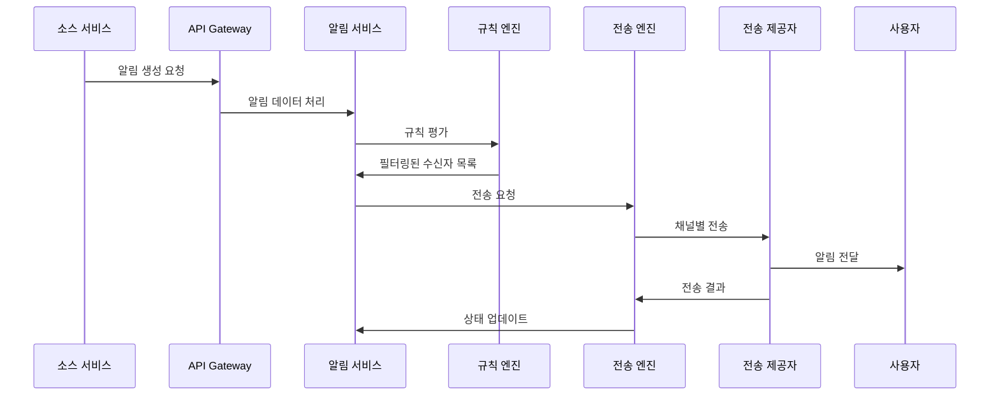
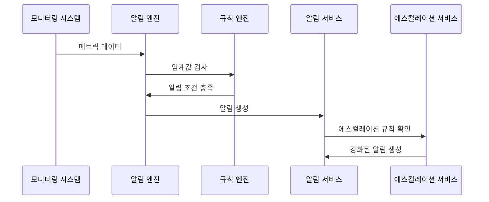
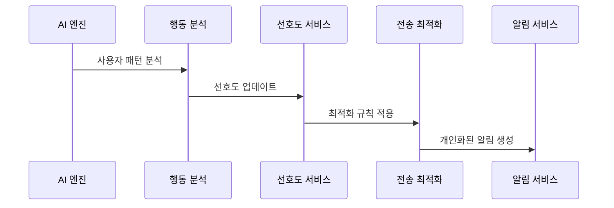

# Notification & Alert Service PRD

## 📌 서비스 개요

스마트한 알림 및 경고 시스템으로, 다채널 알림 전송, 개인화된 알림 규칙, 실시간 모니터링 알림, 그리고 AI 기반 알림 최적화를 제공하는 통합 알림 관리 플랫폼입니다.

## 🎯 비즈니스 목표

1. **통합 알림 허브**: 모든 서비스의 알림을 하나의 시스템에서 관리
2. **스마트 알림**: AI 기반 개인화 및 중요도 자동 분류
3. **다채널 지원**: 이메일, SMS, 푸시, 슬랙, 팀즈 등 다양한 채널
4. **실시간 모니터링**: 시스템 상태 및 비즈니스 지표 실시간 감시
5. **알림 피로도 방지**: 스마트 그룹핑 및 요약으로 알림 최적화

## 👥 사용자 스토리

### 일반 사용자
- 중요한 업무 알림만 선별적으로 수신
- 개인 일정 및 작업 기한 알림
- 멘션 및 댓글 알림 실시간 수신
- 알림 설정 세밀하게 커스터마이즈
- 알림 히스토리 조회 및 관리

### 팀 리더
- 팀 구성원 작업 상태 알림
- 프로젝트 마일스톤 및 데드라인 알림
- 팀 성과 지표 임계값 알림
- 협업 도구 활동 요약 알림
- 회의 및 일정 관련 알림 관리

### 시스템 관리자
- 시스템 장애 및 성능 이슈 즉시 알림
- 보안 위협 및 이상 행동 감지 알림
- 사용량 임계값 초과 알림
- 백업 및 유지보수 작업 알림
- 전사 공지사항 배포 및 관리

### 비즈니스 매니저
- 비즈니스 KPI 달성 현황 알림
- 매출 및 성과 지표 변화 알림
- 고객 피드백 및 만족도 알림
- 시장 동향 및 경쟁사 분석 알림
- 규정 준수 및 감사 관련 알림

## 🏗 기술 아키텍처

### 핵심 컴포넌트
```
notification-alert-service/
├── controller/
│   ├── NotificationController.java
│   ├── AlertController.java
│   ├── SubscriptionController.java
│   ├── TemplateController.java
│   └── AnalyticsController.java
├── service/
│   ├── NotificationService.java
│   ├── AlertService.java
│   ├── DeliveryService.java
│   ├── TemplateService.java
│   ├── SubscriptionService.java
│   ├── PreferenceService.java
│   └── AnalyticsService.java
├── engine/
│   ├── NotificationEngine.java
│   ├── AlertEngine.java
│   ├── DeliveryEngine.java
│   ├── FilterEngine.java
│   └── SchedulerEngine.java
├── provider/
│   ├── EmailProvider.java
│   ├── SmsProvider.java
│   ├── PushProvider.java
│   ├── SlackProvider.java
│   ├── TeamsProvider.java
│   └── WebhookProvider.java
├── ai/
│   ├── SmartPrioritizationService.java
│   ├── DeliveryOptimizationService.java
│   ├── ContentPersonalizationService.java
│   └── AnomalyDetectionService.java
├── monitoring/
│   ├── SystemMonitor.java
│   ├── BusinessMetricsMonitor.java
│   ├── HealthChecker.java
│   └── AlertManager.java
└── rule/
    ├── RuleEngine.java
    ├── ConditionEvaluator.java
    ├── ActionExecutor.java
    └── RuleValidator.java
```

## 🔑 주요 기능

### 1. 스마트 알림 시스템
- **AI 기반 우선순위**: 머신러닝으로 알림 중요도 자동 분류
- **개인화된 필터링**: 사용자 행동 패턴 기반 맞춤 알림
- **알림 그룹핑**: 유사한 알림들 자동 묶음 처리
- **스마트 타이밍**: 최적의 알림 전송 시간 학습
- **컨텍스트 인식**: 현재 상황에 맞는 알림 내용 조정

### 2. 다채널 알림 전송
- **이메일 알림**: 리치 HTML 템플릿, 첨부파일 지원
- **SMS 알림**: 긴급 알림용 문자 메시지
- **모바일 푸시**: iOS/Android 푸시 알림
- **웹 푸시**: 브라우저 알림
- **슬랙/팀즈**: 기업 메신저 연동
- **웹훅**: 외부 시스템 연동을 위한 HTTP 콜백

### 3. 실시간 모니터링 및 알림
- **서버 모니터링**: CPU, 메모리, 디스크, 네트워크 상태
- **애플리케이션 모니터링**: 응답 시간, 오류율, 처리량
- **비즈니스 메트릭**: KPI, 매출, 사용자 활동 지표
- **보안 모니터링**: 로그인 실패, 이상 접근 패턴
- **사용자 정의 지표**: 비즈니스별 맞춤 지표 설정

### 4. 고급 규칙 엔진
- **조건부 알림**: 복잡한 조건식 기반 알림 발송
- **에스컬레이션 규칙**: 단계별 알림 강화 시스템
- **시간 기반 규칙**: 특정 시간대, 요일별 알림 제어
- **사용자 상태 인식**: 온라인/오프라인, 회의중 등 상태 고려
- **빈도 제어**: 동일 알림 반복 방지 및 쿨다운

### 5. 알림 템플릿 시스템
- **다국어 템플릿**: 20개 언어 지원
- **동적 콘텐츠**: 변수 및 조건부 블록
- **반응형 디자인**: 모바일/데스크톱 최적화
- **브랜딩 지원**: 회사별 로고, 색상, 폰트
- **A/B 테스팅**: 알림 효과 최적화

### 6. 알림 분석 및 최적화
- **전송 성공률**: 채널별 전송 통계
- **읽음률 분석**: 사용자별 알림 소비 패턴
- **참여도 측정**: 클릭률, 액션 수행률
- **피드백 수집**: 알림 유용성 평가
- **성능 최적화**: 전송 속도 및 처리량 개선

## 📊 데이터 모델

### Notification Entity
```java
@Entity
public class Notification {
    private Long id;
    private String title;
    private String content;
    private NotificationType type;
    private NotificationPriority priority;
    private Long senderId;
    private Set<Long> recipientIds;
    private Map<String, Object> data;
    private NotificationStatus status;
    private LocalDateTime scheduledAt;
    private LocalDateTime sentAt;
    private LocalDateTime expiresAt;
    private List<NotificationDelivery> deliveries;
    private NotificationTemplate template;
    private String sourceService;
    private String sourceEvent;
    private Map<String, String> metadata;
}

enum NotificationType {
    SYSTEM, USER_ACTION, BUSINESS_EVENT, 
    ALERT, REMINDER, MARKETING
}

enum NotificationPriority {
    LOW, NORMAL, HIGH, URGENT, CRITICAL
}

enum NotificationStatus {
    DRAFT, SCHEDULED, SENDING, SENT, 
    FAILED, CANCELLED, EXPIRED
}
```

### Alert Entity
```java
@Entity
public class Alert {
    private Long id;
    private String name;
    private String description;
    private AlertType type;
    private AlertSeverity severity;
    private AlertRule rule;
    private AlertStatus status;
    private Long ownerId;
    private Set<Long> subscriberIds;
    private Map<String, Object> thresholds;
    private String query;           // 모니터링 쿼리
    private Duration checkInterval;
    private LocalDateTime lastChecked;
    private LocalDateTime lastTriggered;
    private Integer triggerCount;
    private AlertNotificationSettings notificationSettings;
    private Map<String, String> labels;
}

enum AlertType {
    METRIC_THRESHOLD, LOG_PATTERN, HEALTH_CHECK, 
    BUSINESS_RULE, CUSTOM_QUERY
}

enum AlertSeverity {
    INFO, WARNING, ERROR, CRITICAL
}
```

### NotificationDelivery Entity
```java
@Entity
public class NotificationDelivery {
    private Long id;
    private Long notificationId;
    private Long recipientId;
    private DeliveryChannel channel;
    private String channelAddress;  // 이메일 주소, 전화번호 등
    private DeliveryStatus status;
    private String providerId;      // 실제 전송 업체 ID
    private LocalDateTime sentAt;
    private LocalDateTime deliveredAt;
    private LocalDateTime readAt;
    private LocalDateTime clickedAt;
    private String failureReason;
    private Integer retryCount;
    private Map<String, Object> deliveryMetadata;
}

enum DeliveryChannel {
    EMAIL, SMS, PUSH_MOBILE, PUSH_WEB, 
    SLACK, TEAMS, WEBHOOK, IN_APP
}

enum DeliveryStatus {
    PENDING, SENT, DELIVERED, READ, 
    CLICKED, FAILED, BOUNCED, CANCELLED
}
```

### NotificationPreference Entity
```java
@Entity
public class NotificationPreference {
    private Long userId;
    private Map<NotificationType, ChannelPreference> typePreferences;
    private Map<DeliveryChannel, ChannelSettings> channelSettings;
    private QuietHours quietHours;
    private Set<String> mutedSources;
    private FrequencyLimits frequencyLimits;
    private LanguagePreference language;
    private TimeZone timezone;
    private Boolean enableSmartFiltering;
    private Boolean enableDigestMode;
    private DigestSettings digestSettings;
}

class ChannelPreference {
    private boolean enabled;
    private NotificationPriority minPriority;
    private Set<NotificationType> allowedTypes;
    private Set<String> allowedSources;
}
```

### NotificationTemplate Entity
```java
@Entity
public class NotificationTemplate {
    private Long id;
    private String name;
    private String description;
    private NotificationType applicableType;
    private String language;
    private Map<DeliveryChannel, TemplateContent> contents;
    private Map<String, TemplateVariable> variables;
    private TemplateStatus status;
    private Long createdBy;
    private LocalDateTime createdAt;
    private LocalDateTime updatedAt;
    private Integer version;
}

class TemplateContent {
    private String subject;         // 이메일 제목, 푸시 제목 등
    private String body;            // 메인 내용
    private String htmlBody;        // HTML 버전
    private Map<String, String> headers;
    private List<String> attachments;
}
```

## 🔄 워크플로우

### 1. 알림 생성 및 전송 플로우


### 2. 실시간 모니터링 알림 플로우


### 3. 개인화된 알림 최적화 플로우


## 📈 성과 지표 (KPI)

### 전송 성능
- **전송 성공률**: 99.5% 이상
- **전송 속도**: 초당 10,000건 이상 처리
- **전송 지연시간**: 평균 500ms 이하
- **시스템 가용성**: 99.99% 이상

### 사용자 참여도
- **알림 읽음률**: 85% 이상
- **클릭률**: 15% 이상
- **구독 취소율**: 5% 이하
- **사용자 만족도**: 4.2/5.0 이상

### 비즈니스 효과
- **알림 피로도 감소**: 30% 이상
- **중요 알림 놓침 방지**: 95% 이상
- **업무 효율성 향상**: 20% 이상
- **대응 시간 단축**: 50% 이상

### 기술 지표
- **메시지 큐 지연**: 평균 10ms 이하
- **데이터베이스 응답**: 평균 5ms 이하
- **API 응답 시간**: 95% 요청이 100ms 이하
- **오류율**: 0.1% 이하

## 🔒 보안 요구사항

### 데이터 보호
- **암호화 전송**: 모든 알림 데이터 TLS 암호화
- **개인정보 보호**: GDPR, CCPA 준수
- **데이터 최소화**: 필요한 최소한의 데이터만 수집
- **보존 정책**: 자동 데이터 삭제 및 아카이브

### 접근 제어
- **인증 및 권한**: OAuth 2.0, RBAC 기반 접근 제어
- **API 보안**: Rate limiting, API 키 관리
- **감사 로그**: 모든 중요 작업 로그 기록
- **무결성 검증**: 메시지 변조 방지

### 컴플라이언스
- **이메일 규정**: CAN-SPAM, GDPR 준수
- **SMS 규정**: TCPA, 통신사 정책 준수
- **프라이버시**: 수신 동의 관리
- **데이터 거버넌스**: 데이터 분류 및 보호

## 🚀 구현 우선순위

### Phase 1: 기본 알림 시스템 (4-6주)
1. **핵심 알림 기능**
   - 기본 알림 생성/발송
   - 이메일, 푸시 알림 지원
   - 사용자 선호도 관리
   - 기본 템플릿 시스템

2. **기본 모니터링**
   - 시스템 헬스 체크
   - 기본 지표 모니터링
   - 간단한 임계값 알림

### Phase 2: 다채널 및 규칙 엔진 (6-8주)
3. **다채널 지원**
   - SMS, 슬랙, 팀즈 연동
   - 웹훅 지원
   - 채널별 포맷팅

4. **규칙 엔진**
   - 조건부 알림 규칙
   - 사용자 그룹 관리
   - 빈도 제어

### Phase 3: AI 및 고급 기능 (8-12주)
5. **AI 기반 최적화**
   - 스마트 우선순위
   - 개인화 추천
   - 최적 전송 시간

6. **고급 모니터링**
   - 비즈니스 메트릭 모니터링
   - 사용자 정의 대시보드
   - 복합 조건 알림

### Phase 4: 분석 및 최적화 (4-6주)
7. **알림 분석**
   - 전송 통계 및 분석
   - 사용자 참여 분석
   - A/B 테스트 기능

8. **성능 최적화**
   - 대용량 처리 최적화
   - 실시간 스트리밍
   - 글로벌 배포

## 🌐 글로벌화 고려사항

### 다국가 서비스
- **지역별 데이터센터**: 전송 속도 최적화
- **현지 통신사 연동**: 국가별 SMS 서비스
- **법규 준수**: 국가별 통신 법규 준수
- **시간대 처리**: 글로벌 시간대 지원

### 문화적 적응
- **언어 지역화**: 20개 언어 지원
- **문화적 맥락**: 지역별 커뮤니케이션 스타일
- **현지 휴일**: 국가별 휴일 및 근무시간 고려
- **통화 및 날짜**: 지역별 형식 지원

## 📱 모바일 최적화

### 모바일 알림
- **네이티브 푸시**: iOS/Android 네이티브 지원
- **배터리 최적화**: 효율적 알림 스케줄링
- **오프라인 지원**: 네트워크 복구 시 자동 재전송
- **위치 기반**: GPS 기반 컨텍스트 알림

### 모바일 앱 통합
- **SDK 제공**: iOS/Android SDK
- **실시간 동기화**: 앱 상태와 알림 동기화
- **인앱 알림**: 앱 내 알림 센터
- **알림 설정**: 앱 내 세밀한 설정

## 🔌 외부 시스템 통합

### 모니터링 도구 연동
- **Prometheus**: 메트릭 수집 및 알림
- **Grafana**: 대시보드 및 알림 룰
- **ELK Stack**: 로그 기반 알림
- **New Relic**: APM 연동

### 비즈니스 도구 연동
- **CRM 시스템**: 고객 이벤트 알림
- **ERP 시스템**: 비즈니스 프로세스 알림
- **마케팅 도구**: 캠페인 알림
- **분석 도구**: 지표 기반 알림

### 클라우드 서비스 연동
- **AWS SNS/SES**: 클라우드 알림 서비스
- **Azure Communication**: Microsoft 통신 서비스
- **Google Cloud Messaging**: Google 알림 서비스
- **Twilio**: SMS/음성 알림 서비스

## 🔮 미래 로드맵

### 단기 (6개월)
- **대화형 알림**: 알림에서 직접 액션 수행
- **음성 알림**: AI 어시스턴트 음성 알림
- **증강 현실**: AR 기반 시각적 알림

### 중기 (1년)
- **예측적 알림**: 문제 발생 전 사전 알림
- **자연어 처리**: 알림 내용 자동 생성
- **감정 인식**: 사용자 감정 상태 고려

### 장기 (2년)
- **뇌파 연동**: BCI 기반 직관적 알림
- **홀로그램**: 3D 홀로그램 알림
- **양자 통신**: 양자 암호화 보안 알림

## 📊 비용 최적화

### 전송 비용 관리
- **채널별 비용 분석**: ROI 기반 채널 선택
- **대량 할인**: 통신사와 대량 계약
- **지능형 라우팅**: 비용 효율적 경로 선택
- **실패 최소화**: 전송 실패율 감소로 비용 절약

### 인프라 최적화
- **오토 스케일링**: 트래픽에 따른 자동 확장
- **캐싱 전략**: 템플릿 및 설정 캐싱
- **배치 처리**: 유사 알림 묶음 처리
- **압축 및 최적화**: 데이터 전송량 최소화